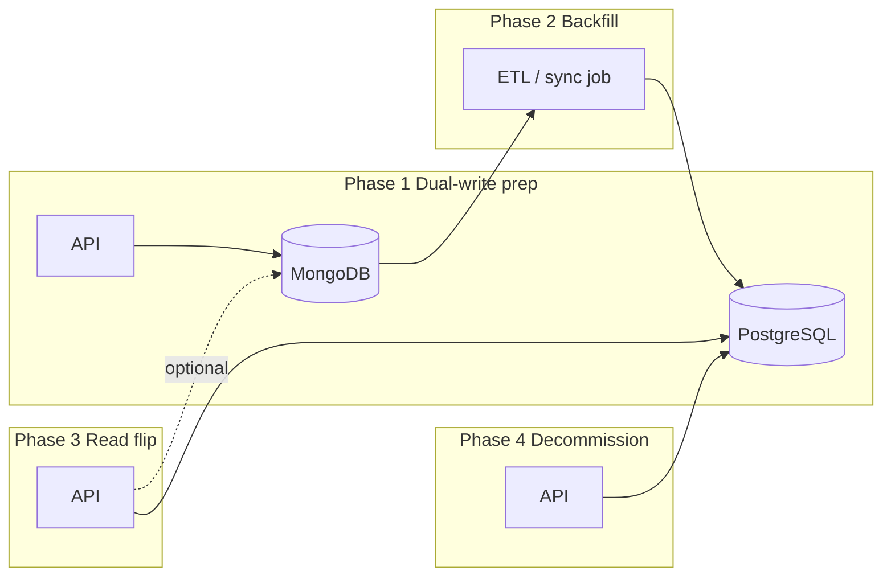

# MongoDB → PostgreSQL migration plan (Online Competitions)

**Status:** Draft for engineering planning  
**Date:** 2026-10-04  
**Context:** [database-audit.md](./database-audit.md), ~45 Mongoose models, Better Auth on Mongo (`user`, `session`, `account`), product data in `@oc/api-db`.

---

## 1. Goals and non-goals

### Goals

- Move **product data** and **auth storage** to PostgreSQL with explicit relational schema, FKs, and constraints matching business invariants (tickets, orders, payments, referrals).
- Improve **predictability** for reporting, finance, compliance exports, and admin search (SQL vs ad-hoc aggregations).
- Keep **API contracts** stable for client/admin/mobile during migration (same JSON shapes where possible).
- Zero or minimal **checkout / draw / instant-win** downtime at cutover.

### Non-goals (initial release)

- Rewriting the whole monorepo architecture or splitting microservices.
- Big-bang rewrite of every admin screen before cutover.
- Changing payment provider integrations beyond what storage migration requires.
- Migrating historical TTL-expired data (sessions, old webhooks, deleted carts) unless legally required.

---

## 2. Why migrate (project-specific)

Online Competitions is modeled as **many linked entities** (competitions, tickets, orders, profiles, instant prizes, shop, referrals). Mongo is used with **Mongoose schemas + `$lookup` aggregations**—effectively a relational model on a document store. That works but increases cost for:

- Integrity enforcement at the DB layer (unique ticket per competition, order idempotency, promo redemptions).
- Admin/global search and heavy aggregations ([database-audit.md § Performance hotspots](./database-audit.md)).
- Operational maturity (backups, PITR, read replicas, standard SQL tooling).

PostgreSQL does not guarantee speed by itself; it aligns **schema + queries** with how the product already behaves.

---

## 3. Current state (inventory)

| Layer | Technology | Notes |
|-------|------------|--------|
| Product ORM | Mongoose (`packages/api/db`) | ~45 models, soft-delete plugin, migrations registry |
| Connection | `DATABASE_URL` / `MONGO_URI`, pool max 50 | `packages/api/infra/src/db.ts` |
| Auth | Better Auth + `mongodbAdapter` | `packages/auth/admin/src/build-auth.ts` |
| Identity link | `Profile._id` === Better Auth user id | String/ObjectId duality in places (audit **C1**) |
| Server | Hono routes, direct model/aggregate usage | Widespread in `packages/api/server` |
| TTL / ephemeral | sessions, carts, webhooks, partial order TTL | Must be reimplemented (PG jobs or retain Redis/Mongo briefly) |

**Fix before or in parallel with migration:** Better Auth `user` updates by `_id` (audit **C1**), production Mongo hardening if cutover is delayed.

---

## 4. Target architecture

### 4.1 Database

- **PostgreSQL 16+** (managed: RDS, Cloud SQL, Neon, Supabase, or self-hosted).
- **Extensions (likely):** `pgcrypto` / `gen_random_uuid()`, optional `citext` for email, optional `pg_trgm` for admin search.
- **Naming:** `snake_case` tables/columns; `timestamptz` for all event times; `numeric(12,2)` (or minor units) for money.

### 4.2 Application data access

Pick **one** primary access layer and stick to it:

| Option | Pros | Cons |
|--------|------|------|
| **Drizzle** | TypeScript-first, SQL-like, good migrations | Team learning curve |
| **Prisma** | Migrations, tooling, Better Auth adapter | Heavy schema DSL |
| **Kysely** | Thin SQL builder | More manual migration work |

**Recommendation:** **Drizzle** (or Prisma if Better Auth docs/examples for your version strongly favor it). Replace Mongoose model calls incrementally behind **repository interfaces** so routes do not import Mongoose directly long-term.

### 4.3 Auth

- Switch Better Auth to **PostgreSQL adapter** (`better-auth/adapters/drizzle` or prisma equivalent).
- Migrate collections: `user`, `session`, `account`, `verification` → PG tables per Better Auth schema.
- Keep **`profiles`** as product table with **`user_id` UUID/TEXT FK** to auth user (same id strategy as today: single id across auth + profile).

### 4.4 IDs

- **New rows:** `uuid` (v7 if PG18+, else `gen_random_uuid()`) or keep **24-char hex** during transition for easier diff with Mongo exports.
- **Migration:** Map Mongo `ObjectId` → `uuid` or `char(24)` consistently; document mapping table `legacy_mongo_ids (collection, mongo_id, pg_id)` for support.

---

## 5. Schema design (domain phases)

Design in **dependency order**. Each domain gets: ER diagram, Drizzle/Prisma schema, indexes, FK list, parity tests vs Mongo.

### Phase A — Foundation

- `profiles` (extends auth user; referral fields, compliance flags)
- `categories`, settings singletons (`seo_settings`, `email_settings`, `compliance_settings`, …)
- Soft delete: `deleted_at timestamptz` + partial indexes `WHERE deleted_at IS NULL` (match current plugin behavior)

### Phase B — Commerce core

- `competitions`, `tickets` (**UNIQUE (competition_id, number)**)
- `orders`, `order_items`, `payment_attempts`, `processed_webhooks`, `pending_webhooks`
- `carts`, `cart_items` (TTL → scheduled job: delete stale carts)
- `promo_codes`, **`promo_redemptions`** (normalize audit **M15–M16** instead of `usedBy[]`)

### Phase C — Prizes & draws

- `winners`, `draw_sheets`, `bonus_awards`, `competition_bonus_award_assignments`, `bonus_award_fires`, `bonus_award_wins`
- `instant_prizes`, `competition_instant_prizes`, `instant_prize_wins`
- Arrays like `winning_entry_numbers`: **JSONB** or **`competition_instant_prize_winning_numbers`** junction table (prefer normalized table if you query/filter by number often)

### Phase D — Shop & balance

- `shop_products`, `shop_product_variants`, `shop_categories`, `shop_orders`, `shop_carts`
- `balances`, `balance_transactions`

### Phase E — Referrals & notifications

- `referral_settings`, `referral_purchases`, conversion logs
- `notifications`, `notification_campaigns`, `push_subscriptions`

### Phase F — Compliance & audit

- `compliance_audit_logs`, `self_exclusion_override_requests`

**JSONB:** Use only for truly optional blobs (e.g. metadata, image gallery ordering) — not for relations.

---

## 6. Migration strategy (strangler, not big bang)

### Step 0 — Preparation (2–3 weeks)

- [ ] Choose ORM + hosting; provision PG staging.
- [ ] Add `DATABASE_URL_PG`; no production cutover yet.
- [ ] Introduce **repository interfaces** for 2–3 hottest domains (orders, tickets, competitions).
- [ ] Fix **C1** (auth user role sync) on Mongo so behavior is correct before copying data.
- [ ] Document all **unique indexes and invariants** from [database-audit.md § Integrity](./database-audit.md).

### Step 1 — Schema + empty PG (2–4 weeks)

- [ ] Implement Phase A–B schema in PG; run migrations in CI.
- [ ] Better Auth PG adapter on **staging only**; new test users in PG.
- [ ] Parity tests: create competition, order, ticket in PG test DB.

### Step 2 — Historical backfill (2–4 weeks, parallel with Step 1)

- [ ] Write **idempotent ETL scripts** (Bun/Node): Mongo cursor → transform → PG `COPY` / batch insert.
- [ ] Order: profiles/users → competitions → tickets → orders → dependents.
- [ ] Validate row counts, checksums, spot-check FKs, ticket uniqueness, order totals.
- [ ] Keep `legacy_mongo_ids` for support tooling.

### Step 3 — Dual-write (optional, 2–3 weeks)

- [ ] For critical paths (checkout, ticket assignment), write **Mongo + PG** in one transaction where possible, or PG with outbox pattern.
- [ ] Reconciliation job: diff counts and sample documents nightly.

### Step 4 — Read migration by route group (4–8 weeks)

Flip reads behind feature flags, **low risk first**:

1. Settings / categories / SEO  
2. Admin list-only screens  
3. Public competition catalog  
4. Cart (non-checkout)  
5. **Checkout + payment webhooks** (highest risk — last)  
6. Draws, instant wins, ticket assignment  

Each flip: enable PG read → monitor errors/latency → disable Mongo read for that module.

### Step 5 — Auth cutover (1–2 weeks, coordinated)

- [ ] Migrate `user` / `session` / `account` rows to PG.
- [ ] Force session refresh or maintenance window for admin.
- [ ] Point Better Auth adapter to PG in production.

### Step 6 — Decommission Mongo (1 week)

- [ ] Read-only Mongo snapshot for archive.
- [ ] Remove Mongoose from hot paths; delete dual-write.
- [ ] Update `docs/local-development.md` for Docker Postgres + auth.

---

## 7. Query migration patterns

| Mongo pattern today | PostgreSQL approach |
|--------------------|---------------------|
| `$lookup` + `$facet` pagination | SQL `JOIN` + `COUNT(*) OVER()` or separate count query; keyset pagination for large lists |
| Aggregation `maxTimeMS` | `statement_timeout`, proper indexes, EXPLAIN on staging |
| Regex search (`fuzzy-search`) | `pg_trgm` + GIN, or dedicated search (Meilisearch) later |
| Soft delete plugin | `WHERE deleted_at IS NULL` + partial unique indexes |
| TTL indexes | `pg_cron` or app scheduler deleting `WHERE expires_at < now()` |
| Transactions (`startSession`) | `BEGIN … COMMIT` single PG transaction |

**Hotspots to rewrite early:** `GET /api/entries`, admin global search, referral mindmap, landing aggregations (audit § Performance).

---

## 8. Testing and acceptance

| Type | Scope |
|------|--------|
| **Schema** | FK constraints, unique (competition_id, ticket_number), order idempotency |
| **ETL** | Row counts per collection; random 1% field equality; financial totals |
| **Integration** | Checkout E2E, webhook replay, instant win assignment, draw sheet |
| **Load** | Staging k6 on entries + checkout; compare p95 vs Mongo baseline |
| **Rollback** | Feature flag per module back to Mongo read (until Step 6) |

**Definition of done:** Production runs on PG only; Mongo archived; no Mongoose in `packages/api/server` production paths; audit C1/C2 addressed on new store.

---

## 9. Risks and mitigations

| Risk | Mitigation |
|------|------------|
| Checkout regression | Migrate checkout last; dual-write + reconciliation; canary deploy |
| ID type mismatches (string vs ObjectId) | Mapping table; normalize in ETL; tests on admin role APIs |
| Session invalidation at auth cutover | Communicate maintenance; short window |
| Data loss on TTL collections | Explicit policy: what to migrate vs archive |
| Underestimated aggregate rewrite | Module-by-module read flip; keep Mongo snapshot read-only |
| Team bandwidth | Do not parallelize checkout + auth + ETL without dedicated owner |

---

## 10. Rough timeline (single strong backend + DevOps support)

| Milestone | Duration (estimate) |
|-----------|------------------------|
| Prep + schema A–B + staging PG | 4–6 weeks |
| ETL + validation | 3–5 weeks (overlap) |
| Route read flips (non-checkout) | 4–6 weeks |
| Checkout + webhooks + instant wins | 3–4 weeks |
| Auth cutover + Mongo off | 2–3 weeks |
| **Total** | **~4–6 months** (calendar), less with more people, more if scope creep |

Treat as **program**, not a weekend migration.

---

## 11. Immediate next actions (this week)

1. **Decision record:** ORM (Drizzle vs Prisma), PG host, ID strategy (uuid vs legacy ObjectId string).
2. **Spike:** One vertical slice — `categories` + `competitions` in PG with one admin GET route reading PG behind a flag.
3. **ERD workshop:** Phase B + C tables on a whiteboard; align with [postgresql-table-design](https://github.com) conventions (FK indexes, `timestamptz`, money as `numeric`).
4. **Open audit items:** Fix C1 on current Mongo before copying roles to PG.
5. **Stakeholder:** Legal/finance sign-off on order/payment retention vs current Mongo TTL behavior.

---

## 12. Key files to touch (reference)

| Area | Path |
|------|------|
| Models today | `packages/api/db/src/models/**` |
| DB connect | `packages/api/infra/src/db.ts` |
| Auth | `packages/auth/admin/src/build-auth.ts`, `auth-mongo.ts` |
| Routes | `packages/api/server/src/routes/**` |
| Audits | `docs/database-audit.md`, `docs/audit-fix-tracker.md` |
| Local dev | `docs/local-development.md`, Docker compose |

---

## 13. Document history

| Date | Change |
|------|--------|
| 2026-10-04 | Initial migration plan draft |

*Review this plan after the vertical-slice spike; update timelines and ORM choice in §4.2.*
